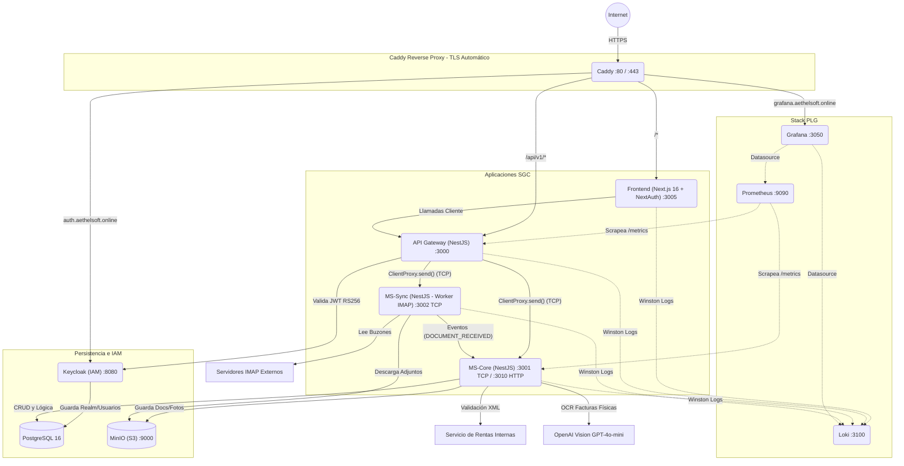

# SGC - Informe Estructurado de Arquitectura y DevOps

## 1. Mapeo de Arquitectura y Microservicios

El sistema opera bajo una **Arquitectura de Microservicios** construida en un **Monorepo** (Turborepo + pnpm) con enfoque en aislamiento de datos (Multi-Tenant) y tolerancia a fallos tipo "Fail-Fast". 

### 1.1 Diagrama de Interacción

### 1.2 Patrones Clave
1. **Comunicación Híbrida**: El `api-gateway` expone HTTP/REST y se comunica vía **TCP** con los microservicios subyacentes (`ms-core` y `ms-sync`) inyectando en la metadata de cada mensaje el `userId` para garantizar el Multi-Tenancy.
2. **Clean Architecture**: `ms-core` separa fuertemente dominios, casos de uso, adaptadores e infraestructura (uso de Factory Methods para proveedores, y repositorios inyectables vía TypeORM).
3. **Máquina de Estados**: Orquestada en la capa de negocio (`PENDIENTE` → `EN_VALIDACION` → `VALIDADO`/`INCONSISTENTE` → `CONSOLIDADO`), con validaciones robustas (cuadre de IVA y Subtotal) al insertar facturas.

---

## 2. Flujo CI/CD (GitHub Actions)

El ciclo de vida se orquesta en GitHub Actions (`ci.yml` y `cd.yml`):

1. **Integración Continua (ci.yml)**: Corre en `main`, `develop` y `qa`. Ejecuta validaciones de caché con Turborepo, Lint, Test (Jest), Análisis Estático con SonarCloud, y un escaneo de seguridad a nivel FileSystem con Trivy. Notifica al bot de Telegram. Adicionalmente, incluye una automatización (Auto-PR) de la rama `qa` hacia `main` en caso de éxito.
2. **Despliegue Continuo (cd.yml)**: Al hacer push a `main`. Usa matrices para construir paralelamente las 4 imágenes Docker de las apps, empujándolas a GitHub Container Registry (`ghcr.io`). Posteriormente se conecta por SSH a una EC2 (`DEPLOY_HOST`), hace pull (via `docker-compose.prod.yml`) y aplica `docker compose up -d` para desplegar.

---

## 3. Análisis Crítico: Vulnerabilidades, Cuellos de Botella y Deuda Técnica

Tras evaluar la infraestructura, dependencias y las respuestas de nuestra sesión de alineamiento, he detectado los siguientes puntos críticos, organizados por prioridad:

### 🔴 Alto Impacto / Fragilidad
1. **Falta de inyección de Variables Públicas (Build-time Frontend):**
   - **Problema:** Next.js requiere que variables con prefijo `NEXT_PUBLIC_*` existan en *tiempo de compilación* si se van a inyectar en bundles estáticos de cliente. El workflow `cd.yml` no utiliza el argumento `build-args` al compilar la imagen de GHCR.
   - **Riesgo:** Aunque NextAuth maneja el estado de sesión server-side, si a futuro un *Client Component* necesita usar `NEXT_PUBLIC_KEYCLOAK_CLIENT_ID` o rutas hardcodeadas hacia dominios externos, la variable vendrá indefinida en producción. 
   - **Sugerencia:** Utilizar inyección dinámica en runtime (ej. vía un endpoint `/api/config`) o incluir `build-args` en el `cd.yml` basándose en Github Secrets.

### 🟡 Medio Impacto / Deuda Técnica Identificada
1. **Modo Desarrollo en IAM (Keycloak `start-dev`):**
   - **Problema:** En el archivo `docker-compose.prod.yml`, Keycloak levanta con el flag `start-dev`. 
   - **Riesgo:** Aunque ya delega la persistencia a Postgres (mitigando pérdida de datos), el modo dev mantiene endpoints no optimizados y características de debug que no cumplen lineamientos de hardening para producción.
   - **Estado:** Identificado como **Deuda Técnica**. Se priorizó la facilidad de despliegue actual.

2. **Downtime durante Despliegues SSH (`latest` y `up -d`):**
   - **Problema:** El pipeline CD hace un `pull` y luego `docker compose up -d` sobre tags `latest`. Docker elimina el contenedor antiguo y levanta el nuevo, provocando segundos/minutos de downtime en una app en producción. El uso de `latest` también previene rollbacks predecibles rápidos.
   - **Estado:** Identificado y **Aceptado** para la fase actual. Como mejora futura, se podría usar Blue-Green deployment en un entorno escalable (Kubernetes o Docker Swarm) o fijar el `IMAGE_TAG=${GITHUB_SHA}`.

3. **Rotación de `ENCRYPTION_KEY` (ms-sync/IMAP):**
   - **Problema:** `ms-sync` cifra/descifra las contraseñas de las aplicaciones IMAP de los usuarios. Si se llegara a rotar el secret `ENCRYPTION_KEY`, todos los descifrados fallarían silenciosamente (el cron no funcionaría).
   - **Estado:** Identificado como **Deuda Técnica**. No hay un mecanismo proactivo (alerta o mail) que avise al usuario de un fallo criptográfico. Se acepta por ahora dado que la llave no se rotará.

4. **Despliegue CD vía SSH en Repositorios Públicos (GitHub Actions):**
   - **Problema:** Para que `cd.yml` ejecute el despliegue automático, el puerto 22 (SSH) del Security Group en AWS debe estar expuesto a las IPs de los runners de GitHub (o al mundo entero `0.0.0.0/0`), lo cual vulnera la regla actual de `admin_ssh_cidr`. La solución ideal es un **runner self-hosted** dentro de la EC2, pero al ser un repositorio **público**, GitHub desaconseja fuertemente los self-hosted runners por riesgos de ejecución de código arbitrario.
   - **Estado:** Identificado como **Deuda Técnica Crítica**. 

5. **Infraestructura No Gestionada por Terraform (Falta de Estado S3):**
   - **Problema:** Los scripts de Terraform en `/infrastructure/terraform/` están bien estructurados (EC2, EIP, SG, KeyPair), pero el comando `terraform apply` nunca se ha ejecutado. La infraestructura actual en producción fue creada manualmente (Click-Ops en consola AWS) y no existe un `.tfstate` remoto (ni local).
   - **Riesgo:** Pérdida de control de la infraestructura y divergencia (drift) entre el código Terraform y la realidad de AWS.
   - **Sugerencia:** Crear un backend S3 + DynamoDB y realizar un proceso de adopción de infraestructura (`terraform import` de la EC2, EIP y Security Group actuales) para que Terraform maneje el entorno de producción.

### 🟢 Observaciones de Robustez y Calidad
- **Aislamiento Multi-Tenant (Excelente):** El uso de `buildTcpMetadata` para pasar el contexto del usuario (JWT) hacia TCP, sumado a las vistas de Base de Datos y las consultas estrictas por `owner_id`, es una práctica excelente para B2B.
- **Fail-Fast (Excelente):** Validar todas las variables de entorno de forma estricta al arrancar los contenedores salva a la plataforma de fallos intermitentes en runtime muy difíciles de trazar.
- **Seguridad en MinIO (Excelente):** Al no exponer MinIO a internet y manejar pre-signed URLs que viajan mediadas por autenticación en el Gateway, evitan fuga de datos confidenciales masiva.

---

## 4. Análisis Interno de Microservicios y Ejecución Local

Cada microservicio del ecosistema está configurado para operar como un bloque atómico con un principio estricto de **Fail-Fast** en la inyección de dependencias y variables de entorno usando `ConfigModule` y esquemas `Joi`.

### 4.1. `api-gateway` (Puerta de Enlace HTTP)
- **Rol:** Actúa como proxy reverso de las solicitudes de los clientes web. No contiene lógica de negocio pesada ni acceso a base de datos.
- **Funcionamiento Interno:**
  - Inicia un servidor HTTP NestJS puro (`main.ts`).
  - Utiliza `ClientsModule.registerAsync` para crear canales TCP seguros (`ClientProxy`) hacia `ms-core` y `ms-sync`.
  - Autenticación: Emplea `passport-jwt` para validar asimétricamente los tokens RS256 de Keycloak. Al recibir un JWT válido, el `IdentitySyncInterceptor` inyecta el `userId` en la metadata de todas las peticiones que se delegan por TCP.
  - Seguridad perimetral: Incluye un límite estricto de velocidad global (Rate Limiting usando `ThrottlerGuard` de 100 req/min) usando la IP del cliente (`trust proxy`).
- **Ejecución Local:** 
  - Corre en el puerto **3000** con prefijo global `/api/v1`. 
  - Expone una interfaz Swagger en `/docs` para depuración interactiva.

### 4.2. `ms-core` (Núcleo de Negocio e Integración SRI)
- **Rol:** Es el corazón del sistema donde reside la Clean Architecture. Ejecuta las validaciones de negocio, persistencia y orquestación de la máquina de estados.
- **Funcionamiento Interno (Híbrido):**
  - Levanta un `Transport.TCP` (puerto 3001) para recibir instrucciones del `api-gateway`.
  - Levanta simultáneamente un servidor HTTP (puerto 3010) empleado exclusivamente para Health Checks y el scrapeo de métricas Prometheus (`/metrics`).
  - Los casos de uso (como `auto-provision-entities.use-case.ts` y la interacción con la API SOAP del SRI) consumen adaptadores inyectados (por ejemplo, OpenAI Vision para OCR).
- **Ejecución Local:** 
  - Depende directamente de que PostgreSQL (almacén de datos) y MinIO (almacenamiento de XML, RIDE y facturas físicas) estén levantados. Si falta la IP o un puerto en el `.env`, el microservicio se niega a arrancar.

### 4.3. `ms-sync` (Worker IMAP Multiusuario)
- **Rol:** Procesa y extrae comprobantes desde los correos de los usuarios.
- **Funcionamiento Interno (Doble Rol):**
  - **Worker Autónomo:** Usa `ScheduleModule` (Cron) para realizar polling sobre cuentas IMAP. Consulta de forma asíncrona a `ms-core` las credenciales IMAP activas, las descifra en memoria y descarga adjuntos fiscales a MinIO.
  - **Servidor y Cliente TCP:** Expone un microservicio TCP (puerto 3002) para forzar escaneos (Trigger), y a la vez actúa como cliente TCP emitiendo el evento `DOCUMENT_RECEIVED` hacia `ms-core` con los metadatos de los XML recibidos.
  - Carece de servidor HTTP expuesto más allá del puerto interno 3012 para métricas.
- **Ejecución Local:**
  - Arranca silenciosamente en background (`pnpm dev` en paralelo). Es vital que comparta exactamente la misma `ENCRYPTION_KEY` que `ms-core`.

### 4.4. `frontend` (Interfaz de Usuario)
- **Rol:** Aplicación web moderna construida con Next.js 16 (App Router) y React. Actúa como el cliente principal para los usuarios del SGC.
- **Funcionamiento Interno y Rutas:**
  - **Autenticación (NextAuth):** Ubicada en `app/api/auth/[...nextauth]`, intercepta el flujo OAuth2 de Keycloak. Mantiene el token en cookies seguras HTTP-only y gestiona el refresco automático de sesión.
  - **Middleware/Proxy de Seguridad:** El archivo `proxy.ts` sirve como barrera primaria. Protege todas las rutas bajo `/dashboard/*` verificando la presencia de las cookies de sesión (e.g. `next-auth.session-token`). Si no hay sesión, expulsa al usuario al root `/` (landing) conservando un `callbackUrl`.
  - **Estructura Modular del Dashboard:**
    - `app/dashboard/layout.tsx`: Realiza la validación fina servidor a servidor (`getServerSession`) y provee la navegación principal.
    - `admin/`: Gestión de roles y usuarios.
    - `documents/`: Visualización, paginación e interacción con comprobantes (facturas, XMLs).
    - `communications/`: Historial de correos e interacciones IMAP procesadas.
    - `suppliers/`: Gestión del catálogo de proveedores (RUC, régimen, etc.).
    - `settings/`: Configuración del usuario, incluyendo credenciales IMAP (cifradas en el backend).
- **Estándares de UI/UX y Funcionalidad (Evidencia de Peticiones de Cambio):**
  - **Internacionalización (i18n):** La Landing Page y el Dashboard cuentan con un sistema de traducción dinámico (`ES | EN`) orquestado por un `LanguageProvider` nativo. 
  - **Validaciones Estrictas (Fail-Fast UI):** Los formularios (ej. Creación de Proveedores) bloquean activamente caracteres inválidos (evitando que se escriban letras en el RUC/Teléfono) y validan las longitudes de forma condicional (13 dígitos si es RUC, 10 dígitos si es Cédula), lanzando mensajes de error internacionalizados.
  - **Estilizado (Neo-Brutalismo):** Usa la última convención de CSS puro (v4) con la directiva `@theme` en `globals.css`. Todo el diseño se apoya en utilidades declarativas y diseño de alto contraste (`.brutal-*`), prescindiendo de dependencias pesadas como Tailwind en runtime.
- **Ejecución Local:** 
  - Corre en el puerto **3005**. El frontend no se comunica con la base de datos de manera directa; todas las peticiones asíncronas pasan por `/api/v1/` hacia el API Gateway.

### 4.5. `packages/shared` (Contratos y Patrones - Análisis Profundo)
- **Rol:** Es la columna vertebral tipada del Monorepo. Este paquete npm local (workspace) actúa como el único origen de la verdad para las firmas de datos, garantizando que el Frontend (Next.js), el API Gateway (NestJS) y los Microservicios (ms-core, ms-sync) hablen exactamente el mismo idioma sin duplicación de código.
- **Anatomía del Aislamiento Multi-Tenant (Capa de Red):**
  - La magia del aislamiento reside en `types/tcp-messages.types.ts`. Cada mensaje que cruza de un microservicio a otro viaja envuelto en una interfaz genérica obligatoria `TcpPayload<T>`.
  - Esta interfaz exige un objeto `data: T` (el payload de negocio, ej. `ICreateDocumentDto`) y un objeto `metadata: TcpRequestMetadata`.
  - La metadata contiene el `correlationId` (para tracing) y el **`userId`**. Como el API Gateway inyecta este `userId` directamente desde el token JWT interceptado, `ms-core` jamás confía en que el usuario envíe su propio ID en el body, previniendo ataques de escalamiento de privilegios por manipulación de payloads.
- **Enrutamiento por Patrones de Mensaje (`constants/message-patterns.constants.ts`):**
  - Elimina los magic-strings de la comunicación. Exporta diccionarios como `DOCUMENT_PATTERNS`, `SUPPLIER_PATTERNS` y `SYNC_PATTERNS`.
  - Cuando el API Gateway hace `this.msCore.send(DOCUMENT_PATTERNS.CREATE, payload)`, el IDE asegura que el nombre de la ruta coincide exactamente con el `@MessagePattern(DOCUMENT_PATTERNS.CREATE)` esperado en el controlador TCP de `ms-core`.
- **Estandarización de Negocio (DTOs y Enums):**
  - Archivos como `document.dto.ts` exponen estrictamente qué campos se esperan al crear o actualizar recursos. 
  - Los enums (como `DocumentStatus` con estados `PENDIENTE`, `EN_VALIDACION`, `VALIDADO`, `CONSOLIDADO`, `INCONSISTENTE`) residen aquí. Al consumirse tanto en el renderizado del Frontend (para pintar badges de colores) como en la Máquina de Estados del backend (`ms-core`), cualquier cambio de estado en la arquitectura de negocio se propaga a todo el monorepo automáticamente con una sola modificación.

---

## 5. Análisis de Infraestructura AWS y Terraform

El proyecto cuenta con un scaffolding excelente en `/infrastructure/terraform`, que modela el entorno productivo con las mejores prácticas:

1. **Firewall (AWS Security Group):**
   - `network.tf` bloquea inteligentemente todo el tráfico externo a las bases de datos (Postgres, Keycloak, MinIO), permitiendo únicamente tráfico público HTTP/HTTPS (80, 443) gestionado por **Caddy** y tráfico SSH (22) restringido a la IP del administrador (`admin_ssh_cidr`).
   - El *egress* está abierto (0.0.0.0/0) para permitir que los microservicios resuelvan endpoints IMAP y APIs externas (OpenAI y SRI).
2. **Cloud-Init (`user_data.sh.tftpl`):**
   - Automatiza la instalación de Docker y Docker Compose plugin nativo.
   - Clona automáticamente el repositorio.
3. **Puntos Ciegos Detectados:**
   - La arquitectura de CD (Continuous Deployment) con Github Actions requiere SSH dinámico, lo que entra en conflicto con la regla estricta del SG sobre el puerto 22.
   - El código en Terraform es **declarativo, pero inactivo**. La infraestructura que corre actualmente `aethelsoft.online` no está atada a un backend de estado de Terraform.

