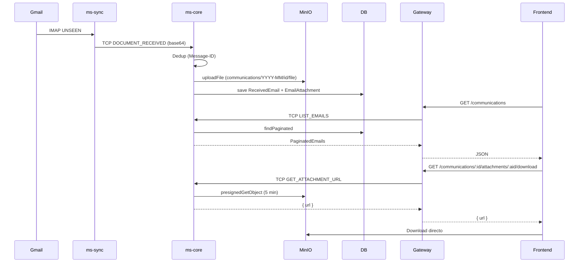

# Walkthrough — Fases 1 a 5.5 Completadas

## Resumen Total del Proyecto

| Fase | Archivos | Descripción |
|------|----------|-------------|
| 1 | 7 | Docker Compose, .env.example, ms-core fail-fast |
| 2 | 5 | Turborepo, pnpm, tsconfig strict |
| 3 | 10 | @sgc/shared: enums, interfaces, DTOs, TCP types |
| 4 | 15 | API Gateway, Keycloak, Supplier Clean Architecture |
| 4.5 | 16 | SRI Pipeline (SOAP, REST, XML sanitizer, XSD) |
| 5 | 10 | ms-sync Worker IMAP |
| **5.5** | **12** | **Comunicaciones + MinIO** |
| **Total** | **75** | |

---

## Fase 5.5 — Comunicaciones + MinIO (12 archivos)

### Flujo Completo



### Archivos por Capa

#### @sgc/shared (1 cambio)
- `COMMUNICATION_PATTERNS` agregado a [message-patterns.constants.ts](file:///c:/Users/trejo/Desktop/S9/construccion/Parcial%20II/Proyecto/packages/shared/src/constants/message-patterns.constants.ts)

#### ms-core / communication (10 archivos nuevos)

| Capa | Archivo | Responsabilidad |
|------|---------|----------------|
| Domain | [received-email.entity.ts](file:///c:/Users/trejo/Desktop/S9/construccion/Parcial%20II/Proyecto/apps/ms-core/src/modules/communication/domain/entities/received-email.entity.ts) | Email metadata + 1:N attachments |
| Domain | [email-attachment.entity.ts](file:///c:/Users/trejo/Desktop/S9/construccion/Parcial%20II/Proyecto/apps/ms-core/src/modules/communication/domain/entities/email-attachment.entity.ts) | MinIO reference (bucket + key) |
| Domain | [received-email-repository.port.ts](file:///c:/Users/trejo/Desktop/S9/construccion/Parcial%20II/Proyecto/apps/ms-core/src/modules/communication/domain/ports/received-email-repository.port.ts) | CRUD + pagination + dedup |
| Domain | [object-storage.port.ts](file:///c:/Users/trejo/Desktop/S9/construccion/Parcial%20II/Proyecto/apps/ms-core/src/modules/communication/domain/ports/object-storage.port.ts) | upload, presigned URL, ensure bucket |
| Infra | [minio.adapter.ts](file:///c:/Users/trejo/Desktop/S9/construccion/Parcial%20II/Proyecto/apps/ms-core/src/modules/communication/infrastructure/adapters/minio.adapter.ts) | Official `minio` SDK, auto-create bucket |
| App | [document-received.handler.ts](file:///c:/Users/trejo/Desktop/S9/construccion/Parcial%20II/Proyecto/apps/ms-core/src/modules/communication/application/handlers/document-received.handler.ts) | `@EventPattern` → dedup → MinIO → DB |
| App | [communication-tcp.controller.ts](file:///c:/Users/trejo/Desktop/S9/construccion/Parcial%20II/Proyecto/apps/ms-core/src/modules/communication/application/controllers/communication-tcp.controller.ts) | `@MessagePattern` queries |
| App | [list-received-emails.use-case.ts](file:///c:/Users/trejo/Desktop/S9/construccion/Parcial%20II/Proyecto/apps/ms-core/src/modules/communication/application/use-cases/list-received-emails.use-case.ts) | Paginated list |
| App | [get-received-email-detail.use-case.ts](file:///c:/Users/trejo/Desktop/S9/construccion/Parcial%20II/Proyecto/apps/ms-core/src/modules/communication/application/use-cases/get-received-email-detail.use-case.ts) | Single email + attachments |
| App | [get-attachment-download-url.use-case.ts](file:///c:/Users/trejo/Desktop/S9/construccion/Parcial%20II/Proyecto/apps/ms-core/src/modules/communication/application/use-cases/get-attachment-download-url.use-case.ts) | **Pre-Signed URL** (5 min) |
| Module | [communication.module.ts](file:///c:/Users/trejo/Desktop/S9/construccion/Parcial%20II/Proyecto/apps/ms-core/src/modules/communication/communication.module.ts) | DI wiring |

#### api-gateway (1 archivo nuevo)

| Archivo | Endpoints |
|---------|-----------|
| [communication.controller.ts](file:///c:/Users/trejo/Desktop/S9/construccion/Parcial%20II/Proyecto/apps/api-gateway/src/controllers/communication.controller.ts) | `GET /communications`, `GET /:id`, `GET /:id/attachments/:aid/download` |

### Decisiones Arquitectónicas

> [!IMPORTANT]
> **El endpoint de download retorna una Pre-Signed URL, NO el buffer del archivo.** El frontend redirige al usuario a esta URL y MinIO sirve el archivo directamente, sin pasar por el gateway ni por ms-core. Esto descarga el tráfico de los microservicios.

> [!NOTE]
> **Deduplicación por Message-ID:** Si ms-sync reprocesa un correo (por reconexión IMAP), el handler verifica `existsByMessageId()` y lo ignora silenciosamente.

> [!WARNING]
> **Repository placeholder:** `ReceivedEmailRepositoryPort` tiene un `useValue` temporal. Se debe implementar el adapter TypeORM/Prisma cuando se configure el ORM.

---

## Árbol communication module (Clean Architecture)

```
communication/
├── communication.module.ts
├── domain/
│   ├── entities/
│   │   ├── received-email.entity.ts
│   │   └── email-attachment.entity.ts
│   └── ports/
│       ├── received-email-repository.port.ts
│       └── object-storage.port.ts
├── infrastructure/
│   └── adapters/
│       └── minio.adapter.ts
└── application/
    ├── handlers/
    │   └── document-received.handler.ts
    ├── controllers/
    │   └── communication-tcp.controller.ts
    └── use-cases/
        ├── list-received-emails.use-case.ts
        ├── get-received-email-detail.use-case.ts
        └── get-attachment-download-url.use-case.ts
```
